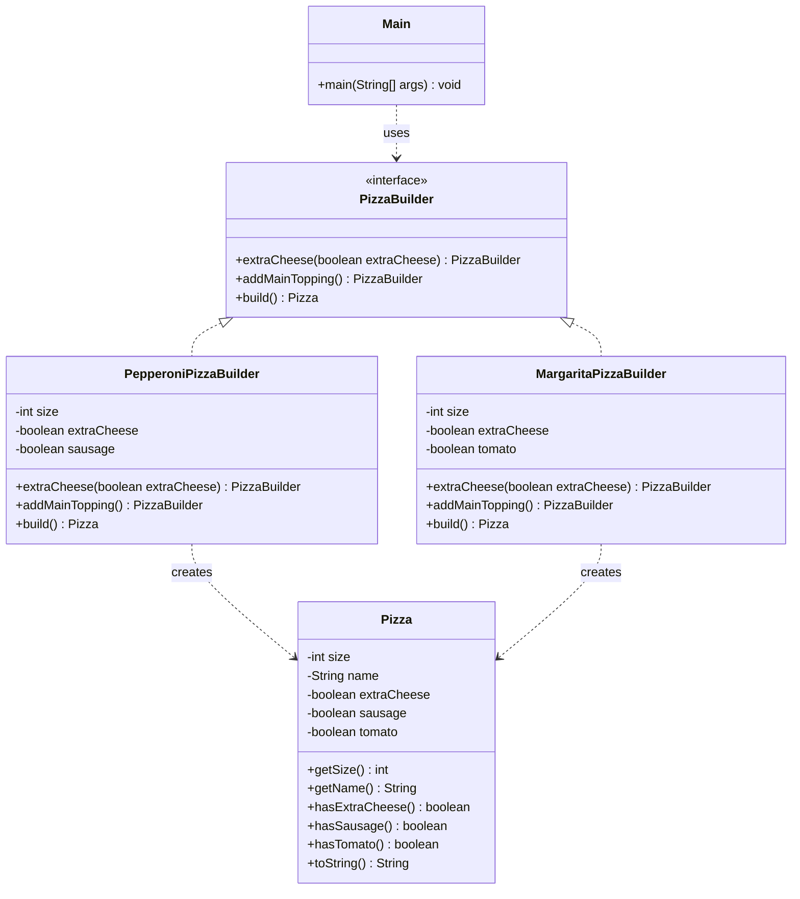

# Pizza Builder Pattern

This is Assignment 1 for the Software Design Patterns course.

The purpose of this assignment is to learn the Builder design pattern and implement it in Java project.

## About the project

This project demonstrates how different pizzas can be created step by step using the Builder pattern.

I chose pizza because it is easy to show why creating a pizza needs Builder pattern. The Builder pattern helps separate the process of creating a pizza from the final `Pizza` object.

The project currently supports two pizza variants:

- Pepperoni, created with `PepperoniPizzaBuilder`
- Margarita, created with `MargaritaPizzaBuilder`

The user chooses the pizza size and whether extra cheese is needed. Each concrete builder knows which main topping should be added.

## Builder pattern components

The project contains the main components of the Builder pattern:

- `Pizza` is the Product. It stores the information about the completed pizza.
- `PizzaBuilder` is the Builder interface. It declares the common construction methods.
- `PepperoniPizzaBuilder` is a Concrete Builder for Pepperoni pizza.
- `MargaritaPizzaBuilder` is a Concrete Builder for Margarita pizza.
- `Main` is the Client. It creates builders and receives completed pizzas.

## Project structure

```text
src/
├── Main.java
├── Pizza.java
├── PizzaBuilder.java
├── PepperoniPizzaBuilder.java
└── MargaritaPizzaBuilder.java
```

## How it works

First, the client creates a concrete builder:

```java
PizzaBuilder builder = new PepperoniPizzaBuilder(30);
```

After that, the pizza is configured step by step:

```java
Pizza pepperoni = builder
        .extraCheese(true)
        .addMainTopping()
        .build();
```

The configuration methods return the same builder. Because of this, the methods can be called in one chain.

The `build()` method validates the construction and returns the completed `Pizza` object.

## Validation

The pizza size must be between 15 and 45 cm.

The project also checks that the main topping was added before creating the final pizza. If the pizza has an invalid size or is not completely built, the program throws an exception with a clear message.

## Requirements

- Java Development Kit 17
- IntelliJ IDEA or another Java IDE

## How to run

1. Clone or download this repository.
2. Open the project in IntelliJ IDEA.
3. Make sure that JDK 17 is selected.
4. Open the `Main.java` file.
5. Run the `main` method.

## Example output

```text
Pizza{size=30 cm, name='Pepperoni', extraCheese=true, sausage=true, tomato=false}
Pizza{size=25 cm, name='Margarita', extraCheese=false, sausage=false, tomato=true}
```

## UML class diagram

UML is a visual way to show the structure of a program. A UML class diagram shows classes, their fields, their methods, and the relationships between classes.

In this project:

- `PepperoniPizzaBuilder` implements `PizzaBuilder`.
- `MargaritaPizzaBuilder` implements `PizzaBuilder`.
- Both concrete builders create `Pizza` objects.
- `Main` uses the `PizzaBuilder` interface.



## Conclusion

While building this project i understood what builder is and why do we need it. It allows you to create an object step by step, it is like a draft of the main object because it store temporary values of the object before it created. 
Also, it allows to create different variants of the object. Overall, this project helped me to understand Builder pattern.